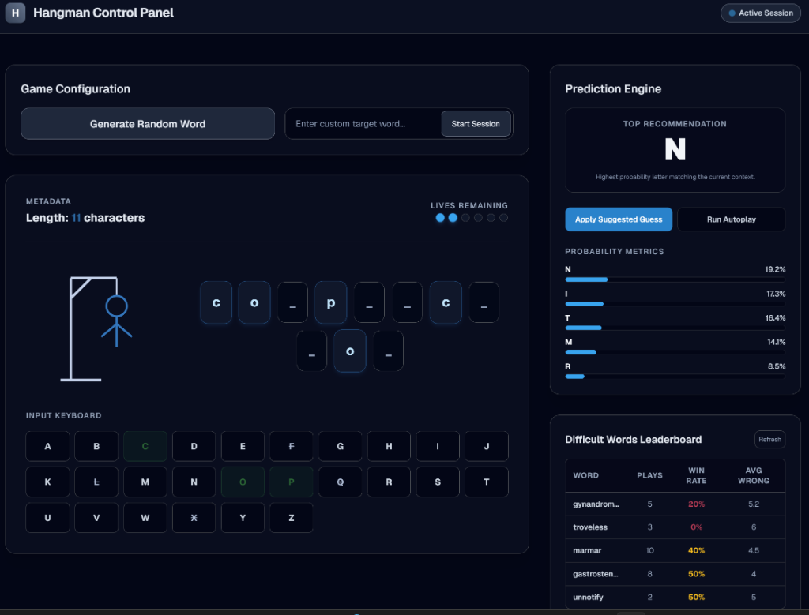

# Intelligent Hangman: HMM & DQN

This project is a lab assignment that implements and benchmarks different algorithmic approaches to solve the game of Hangman. It compares a Hidden Markov Model (HMM) baseline against a Deep Q-Network (DQN) reinforcement learning agent and a PyTorch Transformer sequence model. 

The repository includes a Python FastAPI backend for model inference and a Next.js frontend dashboard to play the game manually or run autoplay evaluations.



## Project Structure

* **`src/`**: Python backend codebase.
  * **`api/`**: FastAPI server endpoints and database logs fallback.
  * **`hmm_oracle.py`**: Bigram-smoothed transition probability model.
  * **`transformer_model.py`**: PyTorch transformer network configuration.
  * **`transformer_oracle.py`**: Handles token masking and model inference.
  * **`dqn_agent.py`**: Deep Q-Network agent using PyTorch.
  * **`evaluate.py`**: Benchmarking script for comparing agents.
* **`frontend/`**: Next.js dashboard UI.
* **`data/`**: Text corpora (`corpus.txt`, `test_words.txt`) and saved model weights.
* **`plots/`**: Performance charts and plots.

## Token Vocabularies

The sequence model maps game state tokens to indices:
* **a to z**: Indices `0` to `25`
* **_** (Mask): Index `26`
* **\<pad>** (Padding): Index `27`
* **\<sep>** (Separator): Index `28`

The model input sequence is constructed as:
`[Masked Word (padded to 20 tokens)]` + `[<sep>]` + `[Wrong Guesses (padded to 26 tokens)]` (Total length: 47 tokens).

## Getting Started

### 1. Run the Backend API
Navigate to the root directory, configure a virtual environment, install packages, and start the FastAPI server:

```bash
# Create and activate environment
python -m venv .venv
.\.venv\Scripts\activate      # Windows (PowerShell)
# source .venv/bin/activate   # Linux/macOS

# Install backend dependencies
pip install -r requirements.txt

# Start the server (runs on port 8000)
python -m uvicorn src.api.main:app --host 127.0.0.1 --port 8000
```

### 2. Run the Frontend Dashboard
Open a new terminal window, navigate to the `frontend` folder, and start the development server:

```bash
cd frontend
npm install
npm run dev
```

The application will be accessible at [http://localhost:3000](http://localhost:3000).

## Performance Benchmark Results

Below is a summary of the performance of the HMM and DQN agents evaluated over 2,000 games (6 lives, seed=42):

| Model & Dataset | Success Rate | Total Wrong Guesses | Final Score |
| :--- | :---: | :---: | :---: |
| **HMM + Greedy** (In-Distribution Corpus) | 95.00% | 3,956 | 170,220 |
| **DQN Hybrid** (In-Distribution Corpus) | 58.45% | 9,093 | 71,435 |
| **HMM + Greedy** (Held-out Test Set) | 32.00% | 10,477 | 11,615 |
| **DQN Strict** (Held-out Test Set) | 2.45% | 11,939 | -54,795 |

*Note: Final Score is computed as `(Success Rate * 2000) - (Wrong Guesses * 5) - (Repeated Guesses * 2)`. The DQN agent's score is negative on the test set due to a high wrong-guess penalty on unseen word structures.*

## Model Evaluation

For complete analysis, training reward curves, and potential design improvements, refer to the [Analysis_Report.md] file.
